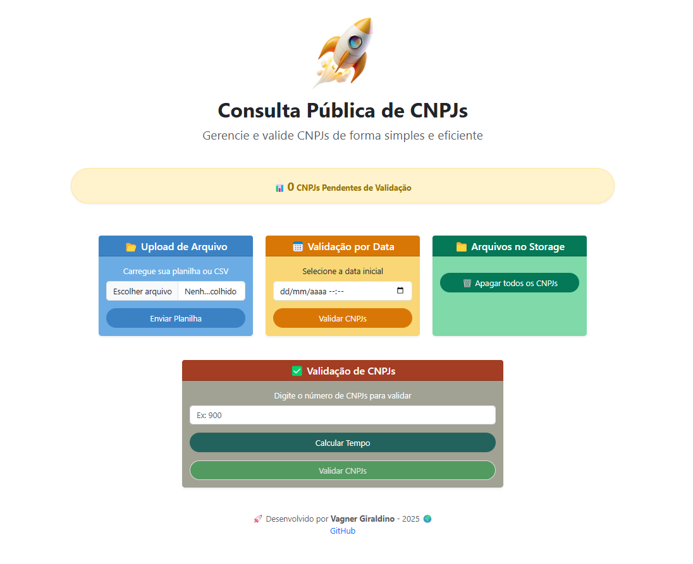

# 📌 Consulta de CNPJs  

Este sistema facilita a validação de uma lista de CNPJs de forma rápida e eficiente. 🚀  

## 🛠️ Tecnologias Utilizadas  
- ✅ **Laravel** – Framework PHP robusto para aplicações web  
- ✅ **Migrations** – Gerenciamento da estrutura do banco de dados  
- ✅ **Bootstrap** – Interface responsiva e intuitiva  

## 🎯 Funcionalidades  

### 📂 Upload de Arquivo  
- Faça o upload de um arquivo contendo **CNPJs sem pontuação e sem espaços**, um por linha.  
- **Exemplo de formato esperado:**  
  ```txt
  66268889000109
  66268889000110
  66268889000111
  ...

### 📅 Validação por Data  
Após o upload, selecione um **intervalo de datas** (inicial e final) para filtrar os CNPJs antes de enviá-los para validação.  

### 📁 Gerenciamento de Arquivos  
- Acesse os arquivos armazenados no sistema (**Storage**).  
- Opção para excluir CNPJs que **não foram validados**.  

### ✅ Validação de CNPJs  
- O sistema exibe o **tempo de análise** para cada CNPJ processado.  
- Validação feita com base no número de CNPJ informado no input.  

## 📌 API Utilizada  
Este sistema consome a API **ReceitaWS**, que permite consultar dados de CNPJs gratuitamente.  
🔗 [Documentação da API ReceitaWS](https://developers.receitaws.com.br/#/operations/queryCNPJFree)  


---

## 🚀 Como Usar?  

### 1️⃣ Clonar o Repositório  
```sh
git clone https://github.com/VagnerGiraldinoJr/consulta-cnpj.git
cd consulta-cnpj

### 2️⃣ Instalar as Dependências
```sh
composer install

### 3️⃣ Configurar o Ambiente
Copie o arquivo .env.example para .env e configure suas credenciais.
```sh
cp .env.example .env

Gere a chave da aplicação:
```sh
php artisan key:generate

### 4️⃣ Rodar as Migrations
```sh
php artisan migrate

### 5️⃣ Iniciar o Servidor
```sh
php artisan serve

### 6️⃣ Acessar no Navegador
```sh
Abra http://127.0.0.1:8000 e comece a usar 🚀

---


